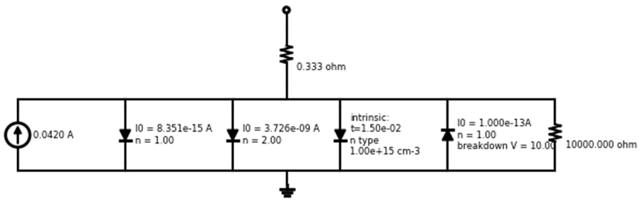
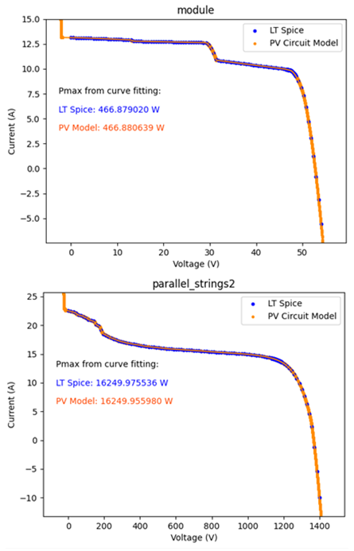
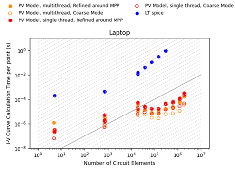
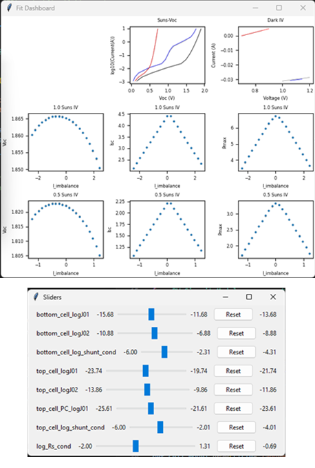
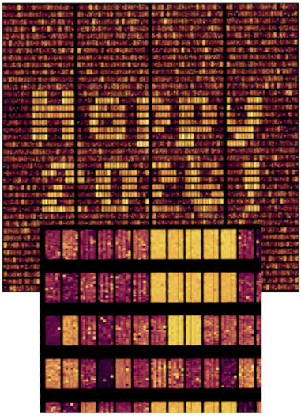

# Summary

PV-Circuit-Model is a Python library for fast DC simulation of photovoltaic (PV) devices and systems using *hierarchical curve stacking*. Rather than solving large nonlinear circuit systems with general-purpose Newton–Raphson methods, the software exploits the predominantly series–parallel structure of PV circuits by assembling I–V curves bottom-up through voltage and current summation. This approach enables accurate and scalable simulation of PV cells, modules, strings, and large arrays with orders-of-magnitude performance improvements over conventional SPICE-based solvers.

The library provides a high-level, developer-friendly Python interface coupled to a performance-critical C++ backend. It supports PV-specific circuit elements, uncertainty propagation, and efficient maximum power point (MPP) determination, enabling applications ranging from parameter extraction in advanced solar cells to cell-level simulation of large PV systems.

# Statement of Need

Photovoltaic devices and systems are naturally represented as hierarchical networks of series and parallel connections. While SPICE-based solvers are widely used to analyze equivalent-circuit models, they are designed for arbitrary circuit topologies and do not exploit this structure. As circuit size increases beyond thousands of nonlinear elements, Jacobian assembly and factorization become the dominant computational bottleneck, making large-scale PV simulations prohibitively slow.

PV-Circuit-Model addresses this gap by providing a specialized solver that explicitly leverages the hierarchical structure of PV circuits. It enables fast and scalable DC simulation while maintaining accuracy comparable to SPICE solvers. The software is intended for researchers and engineers working on solar cell modeling, module and array simulation, and data-driven analysis workflows where throughput and scalability are critical.

# Software Design

PV-Circuit-Model represents circuits as trees of series and parallel connections composed of lumped elements such as current sources, diodes, and resistors. Circuit definitions are expressed concisely in Python, while numerical curve stacking is implemented in C++ for performance.

## Curve stacking algorithm

The core algorithm proceeds as follows:

1. **Bottom-up assembly**: For each series or parallel group, all voltage or current points from the constituent I–V curves are collated. Linear interpolation is used to evaluate each element, and voltages (series) or currents (parallel) are summed.
2. **Adaptive remeshing**: To control curve size, points with vanishingly small slope changes are removed while preserving key features.
3. **Hierarchical propagation**: Steps (1) and (2) are repeated recursively up the connection tree until the root node representing the full device or system is assembled.

For efficient MPP determination, an additional top-down refinement is used. The MPP of the root node is projected down to child elements, local mesh refinement is applied near operating points, and the assembly is repeated with increased resolution where needed.

The library also supports optional uncertainty propagation by tracking upper and lower bounds through the stacking process, yielding conservative bounds on the assembled I–V characteristics.

## PV-specific extensions

PV-Circuit-Model includes domain-specific circuit elements such as intrinsic silicon recombination diodes [@richter2012auger] and photon-coupling diodes for modeling luminescence coupling in series-connected cells. Measurement and data-fitting utilities are provided to support rapid development of maximum a posteriori (MAP) fitting workflows.

# Performance and Benchmarking

Benchmarking was performed against LTspice (x64, version 24.0.12) [@ltspice] using circuits composed of current sources, diodes (n = 1 and n = 2), and resistors. Across all tested cases, I–V curves agree to within 0.01% and maximum power values to within 0.001%.

For circuits with fewer than approximately 1000 elements, representative of individual cells and modules, PV-Circuit-Model is approximately two orders of magnitude faster per operating point. As circuit size increases, LTspice runtime grows rapidly due to Jacobian factorization, while PV-Circuit-Model exhibits sub-linear scaling.

For circuits containing hundreds of thousands of elements, speedups exceeding four orders of magnitude are observed, and circuit sizes beyond which LTspice fails remain tractable for PV-Circuit-Model.

# Example Applications

## Tandem solar cell fitting

The library is used to fit lumped circuit parameters to simulated perovskite–silicon tandem measurements, including light and dark I–V curves and Suns–Voc data. Built-in data-fitting utilities enable rapid construction of iterative maximum a posteriori (MAP) optimization workflows.

## Large-scale array simulation

Cell-level voltage distributions are simulated for large PV array blocks comprising thousands of modules and hundreds of thousands of cells. Systems containing over one million circuit elements are simulated within seconds on commodity hardware.

These examples illustrate the suitability of PV-Circuit-Model for both detailed device analysis and large-scale system studies.

# State of the Field

Equivalent-circuit modeling complements spatially resolved finite-difference and finite-element tools used to extract effective device parameters [@fell2018quokka; @clugston1997pc1d; @wu2017sentaurus; @wong2013griddler]. SPICE-based solvers remain a standard approach for circuit simulation but are not optimized for the hierarchical structure typical of PV systems [@ltspice; @hspice]. PV-Circuit-Model provides a specialized alternative that bridges detailed device modeling and large-scale system simulation.

# Research Impact Statement

PV-Circuit-Model enables simulation workflows that were previously impractical due to the computational cost of conventional SPICE-based solvers. By reducing simulation time by orders of magnitude for large PV circuits, the software supports rapid design iteration for advanced solar cell architectures, cell-level analysis of fielded PV systems, and data-driven parameter extraction at scale. These capabilities are relevant to ongoing research in tandem solar cells, module reliability, and large-scale PV system optimization.

# AI Usage Disclosure

No AI-assisted tools were used in the development of the software or the writing of this paper.

# References
